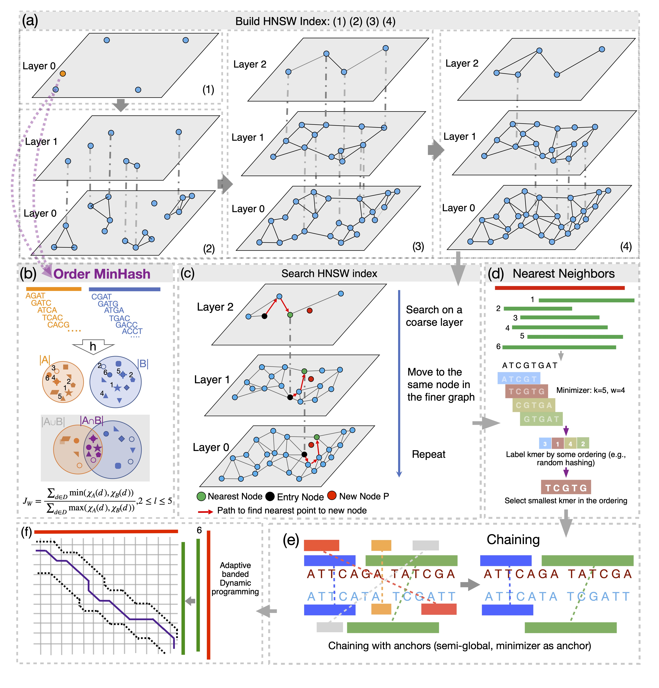

# ADAS:Advanced Database Search for Long Sequences
This crate (currently in development) is designed for searching long sequence databases, especially biological sequences. The core idea is from innovative applications of MinHash, Coreset and hierarchical navigable small world graphs (HNSW) algorithms.

<div align="center">
  
</div>

## Schematic overview of ADAS
Here we simply describe the algorithm:
1. build HNSW graph for all sequences as a database, the underlying algorithm will be Order MinHash, an LSH for Edit distance.
2. Search new sequences against the pre-built database. The same Order MinHash algorithm will be used.
3. For closest sequences to query seqeunces (e.g., top 100), seed-chain-exend and adaptive banded dynamic progrmming will be performed. 

## Install
### compile from source

```bash
wget https://github.com/jianshu93/adas/releases/download/v0.1.0/adas-Linux-x86-64_v0.1.0.zip
unzip adas-Linux-x86-64_v0.1.0.zip
chmod a+x ./adas-*
./adas-build -h

### Install Rust first if you do not have it
### For Linux
git clone https://github.com/jianshu93/adas
cd adas
cargo build --release
cd target/release


### for MacOS
### Install homebrew first here: https://brew.sh
brew install gcc
git clone https://github.com/jianshu93/adas
cd adas
CC="$(brew --prefix)/bin/gcc-14" CXX="$(brew --prefix)/bin/g++-14" cargo build --release
cd target/release

```

## Usage

1. build HNSW database
```bash
adas-build -h

 ************** initializing logger *****************

MinHash sketching and Hierarchical Navigable Small World Graphs (HNSW) building for Long Sequences

Usage: adas-build [OPTIONS] --input <FASTA_FILE>

Options:
  -i, --input <FASTA_FILE>                    Input FASTA file
  -k, --kmer-size <KMER_SIZE>                 Size of k-mers, must be ≤14 [default: 8]
  -s, --sketch-size <SKETCH_SIZE>             Size of the sketch [default: 512]
  -t, --threads <THREADS>                     Number of threads for sketching [default: 1]
      --hnsw-capacity <HNSW_CAPACITY>         HNSW capacity parameter [default: 50000000]
      --hnsw-ef <HNSW_EF>                     HNSW ef parameter [default: 1600]
      --max_nb_connection <HNSW_MAX_NB_CONN>  HNSW max_nb_conn parameter [default: 256]
  -h, --help                                  Print help
  -V, --version                               Print version
```
2. Search pre-built HNSW database
```bash
adas-search -h

 ************** initializing logger *****************

Search Query Sequences against Pre-built Hierarchical Navigable Small World Graphs (HNSW) Index

Usage: adas-search [OPTIONS] --input <FASTA_FILE> --nbng <NB_SEARCH_ANSWERS> --hnsw <DATADIR>

Options:
  -i, --input <FASTA_FILE>        Input FASTA file
  -n, --nbng <NB_SEARCH_ANSWERS>  Number of search answers [default: 128]
  -b, --hnsw <DATADIR>            directory contains pre-built HNSW database files
  -t, --threads <THREADS>         Number of threads for sketching [default: 1]
  -h, --help                      Print help
  -V, --version                   Print version
```
3. Insert new sequences into HNSW database
```bash
./adas-insert -h
 ************** initializing logger *****************

Insert into Pre-built Hierarchical Navigable Small World Graphs (HNSW) Index

Usage: adas-insert [OPTIONS] --input <FASTA_FILE> --hnsw <DATADIR>

Options:
  -i, --input <FASTA_FILE>  Input FASTA file
  -b, --hnsw <DATADIR>      directory contains pre-built HNSW database files
  -t, --threads <THREADS>   Number of threads for sketching [default: 1]
  -h, --help                Print help
  -V, --version             Print version

```
4. Approximate alignment via chaining
```bash
adas-chain -h
Long Reads Alignment via Anchor Chaining

Usage: adas-chain [OPTIONS] --reference <REFERENCE_FASTA> --query <QUERY_FASTA> --output <OUTPUT_PATH>

Options:
  -r, --reference <REFERENCE_FASTA>  Reference FASTA file
  -q, --query <QUERY_FASTA>          Query FASTA file
  -t, --threads <THREADS>            Number of threads (default 1) [default: 1]
  -o, --output <OUTPUT_PATH>         Output path to write the results
  -h, --help                         Print help
  -V, --version                      Print version
```

5. Extrac closest seqeunces (or neighbors) for each sequence in a pre-build database
```bash
 ************** initializing logger *****************

Extract K Nearest Neighbors (K-NN) from HNSW graph, printing actual sequence IDs.

Usage: adas-knn [OPTIONS] --hnsw <DATADIR> --output <OUTPUT_PATH>

Options:
  -b, --hnsw <DATADIR>             Directory containing pre-built HNSW database files
  -o, --output <OUTPUT_PATH>       Output path to write the neighbor list (sequence IDs)
  -n, --k-nearest-neighbors <KNN>  Number of k-nearest-neighbors to extract [default: 32]
  -h, --help                       Print help
  -V, --version                    Print version

```

### use real-world data
```bash
### build graph database from sequences, output in current folder (5 files)
./target/release/adas-build -i ./data/SAR11_cluster_centroid.fa -k 8 -s 128 -t 8 --max_nb_connection 128 --hnsw-ef 800 --scale_modify_f 0.25

### search query against per-built sequence database
./target/release/adas-search -i ./data/query.fasta -b . -n 50

### Insert new sequences into pre-built graph database, e.g., when there are new sequences to be added to the database. Current graph database files will be updated in current folder
./target/release/adas-insert -i ./data/test_16S_SAR11.fa -b . -t 8 

### extrac nearest sequences for each seqeunce in the database. distnance is Jaccard distance
./target/release/adas-knn -b . -n 32 -o adas.knn.txt

### Perform read alignment/overlap via seed-chain-extension, as in minimap2 (default overlap)
./target/release/adas-chain -q ./data/query.fasta -r ./data/SAR11_cluster_centroid.fa -t 8 -o chain.paf
```